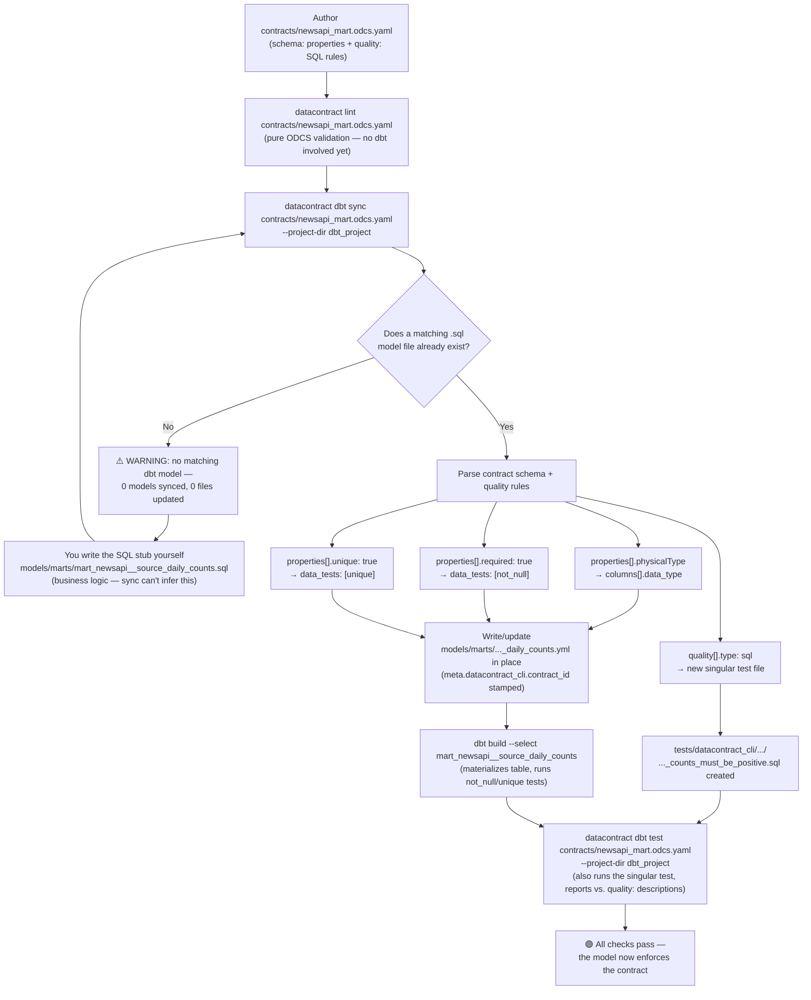
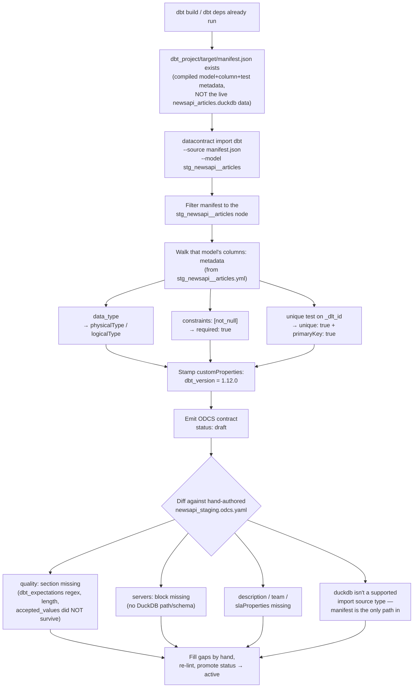

# Getting Started: datacontract CLI ↔ dbt

This is a hands-on companion to the main [README](README.md), focused on one
question: **how do the ODCS contracts in `contracts/` and the dbt models in
`dbt_project/models/` actually stay in sync?**

There are two directions, both provided by `datacontract-cli` (installed here
as `datacontract-cli[duckdb]`, currently `1.1.0` — check with
`uv run datacontract --version`):

| Direction | You start from | Command | Result |
|---|---|---|---|
| **Model-first (export)** | An existing dbt model or an ODCS contract | `datacontract export dbt-sources` / `dbt-models` / `dbt-staging-sql` | One-shot YAML/SQL fragments printed to stdout or a file — you copy-paste them in |
| **Contract-first (sync)** | An ODCS contract, written before any dbt YAML exists | `datacontract dbt sync` | Generates/updates the dbt model's `.yml` (columns, types, tests) **in place**, plus singular SQL test files for custom quality rules |
| **Data-first (import)** | An existing dbt model that already has data flowing through it, no contract yet | `datacontract import dbt --source manifest.json` | A draft ODCS contract reverse-engineered from the model's compiled schema/tests |

The second row is the "scaffolding" workflow you asked about. It's real and
it works — the rest of this doc walks through it end-to-end, using the
`stg_newsapi__articles` data already in this repo as the base. Everything
below was run and verified against this repo's `.venv` (`datacontract-cli
1.1.0`, `dbt-core 1.12.0`, `dbt-duckdb 1.10.1`).

Docs referenced: https://docs.datacontract.com/dbt and
https://docs.datacontract.com/.

---

## 0. Prerequisites

```bash
source .venv/bin/activate      # or: uv run <command> for everything below
uv run datacontract --version  # 1.1.0
```

`datacontract --help` shows the full command surface (verbatim, `1.1.0`):

```
init       Create an empty data contract.
edit       Edit a data contract file in the Data Contract Editor (web UI).
lint       Validate that the datacontract.yaml is correctly formatted.
changelog  Show a changelog between two data contracts.
test       Run schema and quality tests on configured servers.
ci         Run tests for CI/CD pipelines. Emits GitHub Actions annotations
           and step summary.
export     Convert a data contract to a target format.
dbt        Work with data contracts in your dbt project.   <-- this doc
import     Create a data contract from a source format.
catalog    Create an HTML catalog of data contracts.
publish    Publish the data contract to Entropy Data.
api        Start the datacontract CLI as server application with REST API.
```

(The main `README.md`'s "Extending" section used to say `datacontract diff`
— that command doesn't exist in `1.1.0`. **Fixed**: it now says `datacontract
changelog <old-file> <new-file>`, the real command.)

The `dbt` subcommand group is what makes contract-first scaffolding possible:

```
$ uv run datacontract dbt --help
sync  Generate dbt tests and model metadata from one or more ODCS contracts.
test  Run the contract-managed dbt tests that `datacontract dbt sync` generated.
```

---

## 1. Model-first: export existing patterns (what `make contract-export` does)

This repo already does this — see `Makefile:44-48`. Given a contract, generate
the dbt fragments a human would otherwise hand-write:

```bash
# Sources YAML from the RAW contract
uv run datacontract export dbt-sources contracts/newsapi_raw.odcs.yaml \
  --output contracts/generated/dbt_sources_from_raw.yml

# Model schema YAML from the STAGING contract
uv run datacontract export dbt-models contracts/newsapi_staging.odcs.yaml \
  --output contracts/generated/dbt_models_from_staging.yml

# A starter SELECT for a staging model, scaffolded from a RAW schema object
uv run datacontract export dbt-staging-sql contracts/newsapi_raw.odcs.yaml \
  --schema-name articles_us_en
```

The last command prints:

```sql
select
    _dlt_id, _dlt_load_id, source__name, author, title, description, url, url_to_image, published_at, content
from {{ source('newsapi-raw-articles', 'articles_us_en') }}
```

That's literally the seed of `dbt_project/models/staging/stg_newsapi__articles.sql`
(`_dlt_id`), before the column renames (`source__name → source_name`,
`url_to_image → image_url`) and the `UNION ALL` across locales were added by
hand. Useful for "I already changed the contract, now regenerate the
boilerplate" — but it's a **one-shot dump**, not a live sync: run it again and
it overwrites the output file; it doesn't touch your actual model files for
you.

### 1.1 A bug this repo had, now fixed

`export dbt-sources`/`dbt-models`/`dbt-staging-sql` re-derive each column's
`data_type` through a SQL-dialect type table keyed by `--server`. **Without
`--server`, it silently defaults to a Snowflake-style dialect** — it does
*not* auto-pick the contract's own declared server, even when there's only
one. Confirmed by diffing the two:

```bash
uv run datacontract export dbt-sources contracts/newsapi_raw.odcs.yaml --schema-name articles_us_en   | grep -A1 published_at   # → data_type: TIMESTAMP_TZ  (wrong — Snowflake default)
uv run datacontract export dbt-sources contracts/newsapi_raw.odcs.yaml --schema-name articles_us_en --server duckdb-local   | grep -A1 published_at   # → data_type: TIMESTAMP     (correct — duckdb)
```

`Makefile:46-47` (`contract-export`) called the export commands with no
`--server`, so `contracts/generated/dbt_sources_from_raw.yml` and
`dbt_models_from_staging.yml` had `published_at: TIMESTAMP_TZ` committed —
a type DuckDB's `sources.yml` would never actually declare. **Fixed**: both
`Makefile` targets now pass `--server duckdb-local` explicitly, and the two
generated files have been regenerated (`published_at: TIMESTAMP` in both
now). Passing `--server` also pulled in `database: ./newsapi_articles.duckdb`
and `schema: newsapi_raw` into `dbt_sources_from_raw.yml`, which weren't
present before — a bonus, not just the type fix.

(`dbt sync` in §2 does **not** have this problem — see §6, it reads the
contract's own declared server automatically.)

---

## 2. Contract-first: scaffold a dbt model from a new contract

This is `datacontract dbt sync`. Docs summary
(https://docs.datacontract.com/dbt):

> Define an ODCS contract, run `datacontract dbt sync`, and the CLI
> automatically generates corresponding dbt model YAML with tests and
> metadata.

**The one nuance the docs gloss over, confirmed by testing it**: `sync`
generates the model's **YAML** (columns, types, `not_null`/`unique` tests,
and singular SQL tests for custom `quality` rules) — it does **not** invent
the SQL transformation logic. dbt needs a `.sql` file to exist (even an empty
stub) before `sync` will touch it. That's the right boundary: a schema can't
tell the tool *how* to compute `article_count`, only what shape and
guarantees the output must have.

### 2.0 How it flows



The loop on the left (`D → E → F → C`) is the guardrail from the nuance
above: `sync` refuses to scaffold YAML for a model it can't find, so the
first run after writing a contract is expected to warn and do nothing until
you add the stub `.sql`. Everything on the right (`D → G → ...`) is what
actually happens on the second run, once that stub exists — traced step by
step next.

### 2.1 Try it yourself: `mart_newsapi__source_daily_counts`

Suppose you want a new mart on top of the existing staging table — daily
article counts per source — and you want to design it contract-first.

**Step 1 — write the contract before any dbt file exists.**

`contracts/newsapi_mart.odcs.yaml`:

```yaml
apiVersion: v3.1.0
kind: DataContract
id: newsapi-mart-source-daily-counts
name: NewsAPI Source Daily Counts
version: 1.0.0
status: active
domain: news
tenant: demo

description:
  purpose: Daily article counts per source, for the mart layer.

servers:
  - server: duckdb-local
    type: duckdb
    database: ./newsapi_articles.duckdb
    schema: main
    environment: dev

schema:
  - name: mart_newsapi__source_daily_counts
    physicalName: mart_newsapi__source_daily_counts
    logicalType: object
    physicalType: table
    description: One row per source per day with article counts.
    properties:
      - name: source_name
        logicalType: string
        physicalType: VARCHAR
        required: true
        description: News source display name.
      - name: article_date
        logicalType: date
        physicalType: DATE
        required: true
        description: Calendar date (UTC) derived from published_at.
      - name: article_count
        logicalType: integer
        physicalType: BIGINT
        required: true
        description: Number of articles from this source on this date.
    quality:
      - type: sql
        description: Counts must be positive.
        query: SELECT COUNT(*) FROM mart_newsapi__source_daily_counts WHERE article_count <= 0
        mustBe: 0
        dimension: conformity
```

Lint it before touching dbt at all:

```bash
uv run datacontract lint contracts/newsapi_mart.odcs.yaml
```

**Step 2 — create the SQL stub.** `sync` needs *a* model file to attach
generated YAML to; the business logic is yours to write:

`dbt_project/models/marts/mart_newsapi__source_daily_counts.sql`:

```sql
{{ config(materialized='table') }}

SELECT
    source_name,
    CAST(published_at AS DATE) AS article_date,
    COUNT(*) AS article_count
FROM {{ ref('stg_newsapi__articles') }}
GROUP BY 1, 2
```

**Step 3 — run the sync.** If you skip step 2, sync warns and does nothing:

```bash
$ uv run datacontract dbt sync contracts/newsapi_mart.odcs.yaml --project-dir dbt_project
```
```
WARNING - Schema `mart_newsapi__source_daily_counts` resolves to model
`mart_newsapi__source_daily_counts`, which has no matching dbt model (no
`.sql` or YAML entry) in this project — nothing to test, skipping. If the
model exists under a different name, try `--model-resolution physicalName`.
mart.odcs.yaml: Synced 0 models: updated 0 YAML files.
Run `datacontract dbt test` to execute the generated tests.
```

(log timestamp/logger-name prefix stripped for readability; the trailing
"Run `datacontract dbt test`" line is printed even here, on the 0-models
path — a slightly odd but real quirk of the CLI's output.)

Once the `.sql` stub from step 2 exists, the same command scaffolds the YAML:

```
$ uv run datacontract dbt sync contracts/newsapi_mart.odcs.yaml --project-dir dbt_project
mart.odcs.yaml: Synced 1 model: updated 1 YAML file, wrote 1 singular SQL test.
  ~ models/marts/mart_newsapi__source_daily_counts.yml
  + tests/datacontract_cli/newsapi_mart_source_daily_counts/newsapi_mart_source_daily_counts__1_0_0__mart_newsapi__source_daily_counts__counts_must_be_positive.sql
Run `datacontract dbt test` to execute the generated tests.
```

Generated `models/marts/mart_newsapi__source_daily_counts.yml` (verbatim
output — not hand-written):

```yaml
version: 2
models:
  - name: mart_newsapi__source_daily_counts
    description: One row per source per day with article counts.
    config:
      meta:
        datacontract_cli:
          contract_id: newsapi-mart-source-daily-counts
    columns:
      - name: source_name
        data_type: VARCHAR
        description: News source display name.
        data_tests:
          - not_null:
              config:
                meta:
                  datacontract_cli:
                    check: mart_newsapi__source_daily_counts__source_name__field_required
                    include_in_tests: true
                    contract_versions:
                      - 1.0.0
                    generated: true
              description: Check that field source_name has no missing values
        meta:
          datacontract_cli:
            generated: true
      - name: article_date
        data_type: DATE
        description: Calendar date (UTC) derived from published_at.
        data_tests:
          - not_null:
              config: { ... }   # identical shape, key renamed to article_date
      - name: article_count
        data_type: BIGINT
        description: Number of articles from this source on this date.
        data_tests:
          - not_null:
              config: { ... }   # identical shape, key renamed to article_count
```

Generated singular test (the `quality:` SQL rule turned into a real dbt
test file), `tests/datacontract_cli/.../..._counts_must_be_positive.sql`:

```sql
-- AUTO-GENERATED by `datacontract dbt sync`. Do not edit.
-- Source contract: newsapi-mart-source-daily-counts@1.0.0 (model: mart_newsapi__source_daily_counts)
{{ config(meta={"datacontract_cli": {"check": "mart_newsapi__source_daily_counts__custom_sql", ...}}) }}
WITH _dc_metric (metric_value) AS (
SELECT COUNT(*) FROM mart_newsapi__source_daily_counts WHERE article_count <= 0
)
SELECT metric_value FROM _dc_metric WHERE metric_value IS NULL OR metric_value <> 0
```

Every `required: true` property became a `not_null` test; the custom `quality`
SQL rule became its own singular test wired to the contract via
`meta.datacontract_cli`. `unique: true` properties (see `_dlt_id` in the real
staging contract) become `unique` tests the same way.

**Step 4 — build and test.**

```bash
DBT_DUCKDB_PATH=$PWD/newsapi_articles.duckdb \
  uv run dbt build --select mart_newsapi__source_daily_counts \
  --project-dir dbt_project --profiles-dir dbt_project
```

Then run the contract-managed tests specifically (this is what makes the
custom SQL quality rule execute — plain `dbt build --select` alone runs the
generic `not_null` tests but not the singular test, since it isn't tied to
the model by `ref()`):

```bash
$ uv run datacontract dbt test contracts/newsapi_mart.odcs.yaml --project-dir dbt_project
Contract newsapi-mart-source-daily-counts@1.0.0 — contracts/newsapi_mart.odcs.yaml
╭────────┬────────────────────────────────────────┬───────────────┬─────────╮
│ Result │ Check                                  │ Field         │ Details │
├────────┼────────────────────────────────────────┼───────────────┼─────────┤
│ passed │ Counts must be positive.               │               │         │
│ passed │ Check that field article_count has no  │ article_count │         │
│        │ missing values                         │               │         │
│ passed │ Check that field article_date has no   │ article_date  │         │
│        │ missing values                         │               │         │
│ passed │ Check that field source_name has no    │ source_name   │         │
│        │ missing values                         │               │         │
╰────────┴────────────────────────────────────────┴───────────────┴─────────╯
🟢 dbt tests passed. Ran 4 tests. Took 0.0XX seconds.
```

(re-ran this three times while validating — always 4/4 passed, timing varies
run to run in the ~0.007–0.010s range, don't treat the exact number as
meaningful)

That's the full loop: **contract → (stub SQL) → `dbt sync` scaffolds
model YAML + tests → `dbt build` materializes → `dbt test` (or
`datacontract dbt test`) enforces the contract at runtime**, with the report
mapped back to the human-readable checks from the contract's `quality:`
section, not raw dbt test names.

### 2.2 Useful `dbt sync` flags

```
--project-dir <path>          dbt project root (must contain dbt_project.yml)
--schema-name <str>           sync only one ODCS schema object, default: all
--model-resolution name|physicalName   how an ODCS schema maps to a dbt model name
--prune / --no-prune          remove model columns/tags not in the contract (default: no-prune)
--run-tests / --skip-tests    run `dbt test` right after syncing (default: skip)
--target, --profiles-dir      forwarded to the underlying `dbt test` call
```

`--prune` matters once contracts evolve: without it, `sync` only *adds*
columns/tests from the contract and leaves anything else in the YAML alone;
with it, the generated YAML becomes an exact mirror of the contract (drop a
column in the contract, `--prune` removes it from the dbt YAML on next sync).

---

## 3. Data-first: generate a contract from a model you already have

Sometimes the model comes first — it's already built, already has data
flowing through it, and nobody wrote a contract for it. `datacontract import
dbt` reverse-engineers a draft ODCS contract from it.

**The source is dbt's compiled `manifest.json`, not the live database.**
DuckDB isn't even in the list of `datacontract import` source types
(`bigquery`, `snowflake`, `postgres`, `redshift`, `mysql`, `sqlserver`,
`oracle`, `trino`, `athena`, `glue`, `s3`, `gcs`, `adls`, `dbt`, ... — no
`duckdb`). The only path in for a dbt-duckdb project like this one is through
the manifest, which already exists in `dbt_project/target/manifest.json` from
the last `dbt build`/`dbt deps` run.

```bash
uv run datacontract import dbt \
  --source dbt_project/target/manifest.json \
  --model stg_newsapi__articles
```

Ran against this repo's own manifest, this is what comes out (verbatim):

```yaml
version: 1.0.0
kind: DataContract
apiVersion: v3.1.0
id: newsapi_demo
name: newsapi_demo
status: draft
schema:
- name: stg_newsapi__articles
  physicalType: table
  description: Staged NewsAPI articles unioned across US-en and DE-de locales. Contract-enforced.
  logicalType: object
  physicalName: stg_newsapi__articles
  properties:
  - name: source_name
    physicalType: varchar
    description: News source name (e.g., 'BBC News').
    logicalType: string
    required: true
  # ... one entry per column, same pattern ...
  - name: _dlt_id
    physicalType: varchar
    description: dlt row-level unique id.
    primaryKey: true
    primaryKeyPosition: 1
    logicalType: string
    required: true
    unique: true
customProperties:
- property: dbt_version
  value: 1.12.0
```

### How it gets there



### The gap — this is a skeleton, not a publishable contract

Diffed against the real, hand-authored `contracts/newsapi_staging.odcs.yaml`:

- **No `quality:` section at all.** The richer tests already defined in
  `stg_newsapi__articles.yml` —
  `dbt_expectations.expect_column_value_lengths_to_be_between` (title
  5–500 chars), `expect_column_values_to_match_regex` (`^https?://`),
  `accepted_values` (`en`/`de`) — do **not** round-trip into ODCS quality
  rules. Only plain `not_null` (from `constraints: [not_null]`) and `unique`
  survive the trip.
- **No `servers:` block** — the contract doesn't know it lives in DuckDB at
  `./newsapi_articles.duckdb`.
- **No `description.purpose/usage/limitations`, `team`, `slaProperties`** —
  none of the "social contract" fields exist yet; dbt has no concept of them
  to import from.
- **`status: draft`** on purpose — treat this as a starting skeleton, not
  something to `lint`/`publish` as-is.

Use this when you're bootstrapping a contract for a model that already
exists and already has consumers, and hand-fill the gaps above before
promoting it to `active`. It's the mirror image of §2: §2 goes contract →
dbt scaffolding when the contract is authored first; this goes dbt → contract
skeleton when the model was built first.

---

## 4. Applying this to the contracts already in this repo

To turn the two demo contracts fully into "sync-managed" instead of the
current copy-paste-from-`contracts/generated/` flow:

```bash
uv run datacontract dbt sync contracts/newsapi_staging.odcs.yaml \
  --project-dir dbt_project --prune
```

**Verified against an isolated copy of `dbt_project/models/staging/` (not the
real project files)** — this is exactly what happens, and it's more invasive
than "just adds tests":

- The hand-written `dbt_expectations.expect_column_value_lengths_to_be_between`,
  `expect_column_values_to_match_regex`, `accepted_values`, and `unique`
  tests already in `stg_newsapi__articles.yml` **survive** — sync adds its
  own generated `not_null` tests alongside them, it doesn't replace them.
- But **every `description:` gets overwritten** from the contract. E.g.
  `source_name`'s hand-written "News source name (e.g., 'BBC News')."
  becomes the contract's "News source display name." — the contract becomes
  the source of truth for prose, silently, on every sync.
- **`data_type` gets normalized to the contract's casing** — `varchar` →
  `VARCHAR`, `timestamp` → `TIMESTAMP`. Harmless for dbt-duckdb, but a diff
  you'll see on every column even when nothing "changed."
- The old-style `constraints: [type: not_null]` blocks are **left in place**
  even with `--prune` — sync only prunes columns/tags absent from the
  contract, not this redundant-but-harmless pre-existing constraint syntax
  sitting next to its own generated `data_tests: [not_null]`.
- A `meta.datacontract_cli.contract_id`/`owner` marker gets added to the
  model's `config.meta` block.

Diff the result before committing if you try this for real — the description
and casing rewrites are the kind of change that's easy to miss in review.
Try it on a branch.

---

## 5. Command reference

| Command | Purpose |
|---|---|
| `datacontract lint <contract>` | Structural ODCS validation (already `make contract-lint`) |
| `datacontract export dbt-sources <contract>` | One-shot: contract → dbt `sources.yml` fragment |
| `datacontract export dbt-models <contract>` | One-shot: contract → dbt model schema YAML |
| `datacontract export dbt-staging-sql <contract> --schema-name <name>` | One-shot: contract → starter `SELECT` from a source |
| `datacontract import dbt --source manifest.json [--model <name>]` | Reverse direction: dbt manifest → new ODCS contract |
| `datacontract dbt sync <contract> --project-dir <dir> [--prune]` | **Contract-first scaffolding**: generates/updates model YAML + tests in place, live, repeatable |
| `datacontract dbt test <contract> --project-dir <dir>` | Runs the contract-managed tests `sync` created, reports pass/fail mapped to contract checks |
| `datacontract test <contract>` | Connects directly to the server in `servers:` and runs schema+quality checks — **not wired for `type: duckdb` in CLI 1.1.0**, see README's "A note on `datacontract test`" |
| `datacontract ci <contract>` | Same as `test`, plus GitHub Actions annotations/step summary |
| `datacontract catalog <contracts...>` | Static HTML catalog of contracts |
| `datacontract publish <contract>` | Push to Entropy Data registry |

---

## 6. Why `datacontract dbt sync` sidesteps the `duckdb` limitation

The README notes `datacontract test` doesn't support `type: duckdb` servers
yet (CLI 1.1.0) — it tries to open a live connection to whatever `servers:`
declares, and duckdb isn't wired into that runtime engine.

`datacontract dbt sync`/`dbt test` **do read `servers:`**, but only to pick a
label and a type-casting dialect (`--server`'s help text: "Auto-selected if
only one server exists, else `--target`") — confirmed by testing: syncing
`newsapi_staging.odcs.yaml` (which declares exactly one server, `duckdb-local`)
correctly emitted `data_type: TIMESTAMP`, the duckdb type, with no `--server`
flag needed. Compare that to §1.1 — `export dbt-sources`/`dbt-models` do
**not** auto-select the single declared server the same way; they default to
Snowflake-style types unless you pass `--server` explicitly. `sync` is the
one command in this whole surface that gets single-server auto-detection
right without you asking for it.

What `sync`/`dbt test` never do is open a live connection to that server —
`sync` compiles the contract into dbt-native tests, and `dbt test` (invoked
either manually or via `datacontract dbt test`) runs through the `dbt-duckdb`
adapter like any other dbt test. That's the practical reason this repo's
runtime enforcement already routes through `dbt build`/`dbt test` rather than
`datacontract test` — and `dbt sync` is the same mechanism, just contract-first
instead of hand-written.
